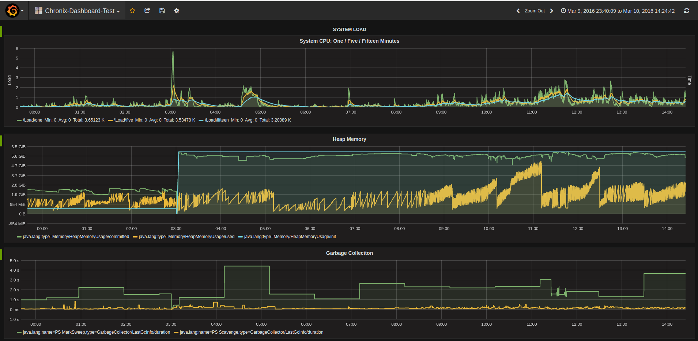

# Chronix Grafana Datasource Plugin

This is the [Grafana](https://grafana.net/) datasource plugin. 
It allows you to query time series from [Chronix-Server](https://github.com/ChronixDB/chronix.server) and visualize it within Grafana.
This plugin works with Grafana > 3.X.X.

## Features

The plugin supports all the native implemented aggregations, transformations, and analyses of Chronix-Server.
We will provide more details soon ;-)

## Usage

Currently the plugin is only available at the chronix github repository. 
It is planned to release the plugin within the app store of grafana.
To use the plugin, simply clone this repository into your Grafana installation's `{inst-dir}\public\app\plugins\chronix`

Optionally, you can download and start from the example dashboard:

1. Download the latest [Chronix-Server](https://github.com/ChronixDB/chronix.server/releases/download/0.3/chronix-0.3.zip)
2. Import the dashboard from 'dashboards' into your running Grafana
3. Download and execute the [csv importer](https://github.com/ChronixDB/chronix.examples/releases/download/0.3/importer.zip) after the Chronix-Server has started

## Contributing

Is there anything missing? Do you have ideas for new features or improvements? You are highly welcome to contribute
your improvements, to the Chronix projects. All you have to do is to fork this repository,
improve the code and issue a pull request.

## Development

We're using a simple grunt task in combination with babel so that we can use ES2015 syntax in our "src" directory but 
the files that will be served to the browser (in "dist") are ES5 compatible and follow the Grafana guidelines.

If you want to change anything, first install everything needed (assuming you already have node and npm on your system):

    npm install

To re-build the whole "dist" directory from "src", simply run the *default* grunt task (we set up npm scripts for you):

    npm run build

To start a watcher that re-builds on every file change, run the *watch* task:

    npm run watch

## Maintainer

Florian Lautenschlager @flolaut

## License

This software is provided under the Apache License, Version 2.0 license.

See the [LICENSE](LICENSE) file for details.
